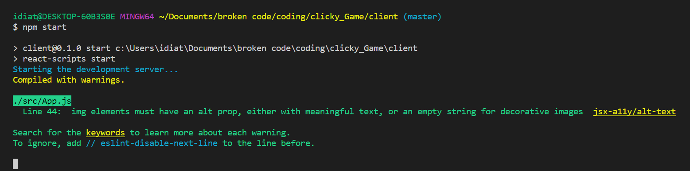

# clicky_Game
# clicky_Game

# project 
Clicky_Game is an app that you can play, it has 8 pictures displayed where you can click and they will relocate each time you click on them until you hit twice on the same image then it reload the score to 0 and put the top score on.

# Getting Started
WARNING: If you are not familiar with the bash/terminal this app may not be suitible for you but feel free to try anyways.

Welcome user! So you want to use my command line node app? Okay! lets get started.

You are going to need to have Node.js Installed in order to run this javascript file in the terminal or command line.

Assuming you are familiar with node as well as the terminal/cli and are ready to move on continue to the next steps

## Installing

You will need to go to my Github repository, you can then either fork the repository and copy the Clone with HTTPS link then run the following command with the link copied from your forked version of the repo to replace what comes after "git clone" from your terminal or bash window or clone my repository the same way using the link on my Github repo the command will look like this in the terminal/CLI:
Command:

## Built With these dependencies
react
react-Dom
reactt-script
## technology used
html, css javascript react and bootstrap

## Running
npm i to install all your packages
npm start to run in your node command then it will display on your localhost port 3000 

this is what you will have on you terminal

